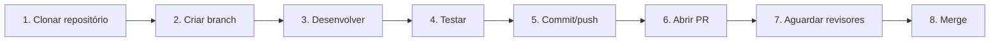

# Guia de Contribuição para o repositório

## Fluxo padrão



1. **Clonar repositório:**

- via HTTP:
```bash
git clone https://github.com/vitormbispo/trabalho-construcao-software.git
```

- via SSH
```bash
git clone git@github.com:vitormbispo/trabalho-construcao-software.git
```

2. **Criar Branch**: crie uma nova branch à partir da padrão `main`:
```bash
# Atualizar commits o remote
git fetch origin

# Alternar e atualizar branch principal
git checkout main
git pull origin main

git checkout -b *NOVA-BRANCH*
```

2.1 **Padrões de nomenclatura branch**: \
- **Para histórias de usuário** -> *CODIGO-DA-HISTORIA* (ex.: US-0001)
- **Para issues** -> *ISS-ID* (ex.: ISS-1, ISS-245)

3. **Desenvolver**: desenvolva normalmente sua tarefa na branch

4. **Testar**: teste localmente suas alterações, garantindo que funcione e que não prejudique outra parte do programa. Execute testes unitários, se disponíveis.

5. **Commit/Push**:
  - Realize os commits. De preferência, siga padrões de commit: https://github.com/iuricode/padroes-de-commits
  - Faça o push criando sua branch no repositório remoto:
```bash
git push --set-upstream origin *NOME-BRANCH*
```

6. **Abrir PR**: após realizar o push, o próprio Git pode te fornecer um link clicável para automaticamente criar o pull request. \
Se esse não for o caso, acesse: https://github.com/vitormbispo/trabalho-construcao-software/compare
   - Mantenha a branch 'base' como `main`
   - Defina a branch 'compare' para a branch que você desenvolveu
   - Adicione título e descrição
   - Clique em 'Create Pull Request'
  
7. **Aguardar revisores**: peça para que alguém do grupo faça uma revisão do seu código. Ao menos uma revisão aprovada é necessário para fazer o merge da sua branch.
8. **Merge**: após aprovação, abra o PR e clique em 'Merge pull request' para mesclar suas alterações na `main`.
